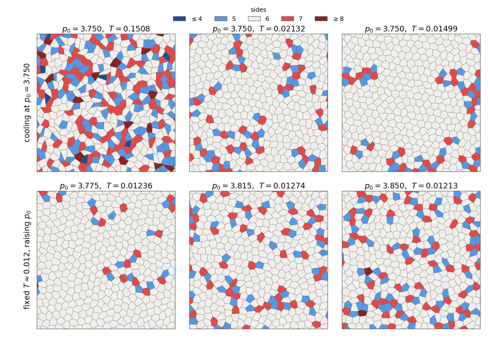
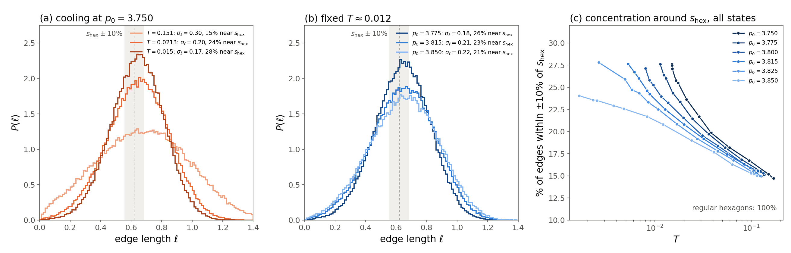

# Cells become more regular hexagons at low \(T\) and \(p_0\), but not exactly

Generated by Claude Code. 2026-09-30. Vertex production runs, \(N=4096\), mean cell area 1. Edges come from the last frame of each of the 10 replicas (about \(1.2\times10^5\) edges per state).

## Picture



A \(20\times20\) window of the \(64\times64\) box. Gray cells are hexagons; blue have 5 sides, red 7. Top row: cooling at \(p_0=3.750\). Bottom row: the same \(T\approx0.012\), raising \(p_0\). Cooling and lowering \(p_0\) both turn the tissue into a nearly all-hexagon tiling. Look closely, though, and the hexagons are clearly not regular: some are stretched, some have short and long sides, and the angles vary.

## Edge lengths

A regular hexagon of area 1 has side
\[
s_{\mathrm{hex}}=\sqrt{\tfrac{2}{3\sqrt3}}\approx0.620 .
\]
If every cell were a regular hexagon, every edge would have exactly this length. \(P(\ell)\) would be a single spike at 0.620.



- **Lower \(T\) (a).** At \(p_0=3.750\) the distribution narrows and piles up around \(s_{\mathrm{hex}}\). The spread \(\sigma_\ell\) drops from 0.30 at \(T=0.151\) to 0.20 at \(T=0.021\) and 0.17 at \(T=0.015\). The share of edges within \(\pm10\%\) of \(s_{\mathrm{hex}}\) (the shaded band) grows from 15% to 24% to 28%.
- **Lower \(p_0\) (b).** At the same \(T\approx0.012\), \(p_0=3.775\) is the most concentrated (\(\sigma_\ell=0.18\), 26% near \(s_{\mathrm{hex}}\)). It is followed by \(p_0=3.815\) (0.21, 23%) and \(p_0=3.850\) (0.22, 21%).
- **All states (c).** Every \(p_0\) starts at about 15% in the hot fluid. At fixed \(T\) the curves are ordered by \(p_0\), with lower \(p_0\) more concentrated. At each \(p_0\)'s coldest \(T\) the share reaches 27–28% (24% at \(p_0=3.850\)).
- **Still far from a spike.** Even in the most regular states, about 72% of edges are more than 10% away from 0.620, and the spread is still about 27% of the mean edge. The mean edge is 0.64 rather than 0.62, because the cells' perimeters stay a bit above the regular-hexagon value.

## Why the edges stay spread out (intuitive picture)

1. **The energy does not care about individual edges.** The vertex model energy is \(\sum_i[(A_i-1)^2+(P_i-p_0)^2]\): it only sees each cell's area and total perimeter. You can shorten one edge and lengthen another in the same cell, keeping \(A\) and \(P\) fixed, at essentially no cost. These "free" shape changes are exactly what thermal noise explores. Cooling makes cells hexagonal (the 6-sided topology is favored), but nothing forces a hexagon's six sides to be equal.
2. **The target shape is not a regular hexagon.** A regular hexagon of area 1 has perimeter 3.722, while all our \(p_0\) are 3.75–3.85. A cell that wants perimeter \(p_0\) at area 1 has to be a stretched or lopsided hexagon. Many different lopsided hexagons have that same perimeter, so there is no single preferred edge length. Lower \(p_0\) is closer to 3.722, so the cells are pushed closer to regular. That is why lower \(p_0\) gives a narrower \(P(\ell)\).
3. **Defects and rearrangements.** The remaining 5- and 7-sided cells have distorted neighbors. Edges shrinking through T1 swaps add very short edges. Both fatten the tails of \(P(\ell)\), and both become rarer on cooling.

## What this means for \(S(q)\)

A sharp scattering signal from "the regular hexagon spacing" would need all edges to be about the same length. With a spread of roughly 27% even at the coldest states, the edge-length signal is heavily smeared out.

- **Where the signal sits.** In 2D a single spacing \(d\) only produces a broad bump near \(q\approx7.0/d\), not a sharp line at \(2\pi/d\).
- **How strongly it is damped.** That bump sits at high \(q\) (about 10–11), where an edge spread \(\sigma_\ell\) damps it by roughly \(e^{-q^2\sigma_\ell^2/2}\). This is about 0.01 when hot and about 0.2 when cold.
- **What survives.** The regularization is visible, but only as the weak second vertex peak near \(4\pi/(\sqrt3\,s_{\mathrm{hex}})\approx11.7\), which grows as the edges narrow. There is never a strong, sharp peak. Details are in `vertexModel_hexagonality_report.md`, section 3.

**Bottom line:** lowering \(T\) and \(p_0\) makes the cells closer to regular hexagons, both in number of sides and in edge lengths. But the edges keep a broad spread, so an \(S(q)\) peak from the hexagon side length should be weak, and it is.

## Files and rerun

- Figures: `vertexModel_edgeRegularity/edge_snapshots.png`, `edge_distributions.png`
- Data: `vertexModel_edgeRegularity/edge_hist.csv` (\(P(\ell)\) of the six plotted states), `edge_summary.csv` (\(\langle\ell\rangle\), \(\sigma_\ell\), fraction within \(\pm10\%\) of \(s_{\mathrm{hex}}\), and \(p_6\) for all 70 states)

```bash
python3 glassyDynamicsProject/analyseScripts/vertexTauAlpha/plot_vertex_hexagonality.py --recompute   # only if hex_metrics.csv is missing
python3 glassyDynamicsProject/analyseScripts/vertexTauAlpha/plot_vertex_edge_regularity.py
```

The second script needs the production trajectories on scratch for the snapshots and histograms. It takes about 1 min and is I/O bound.
