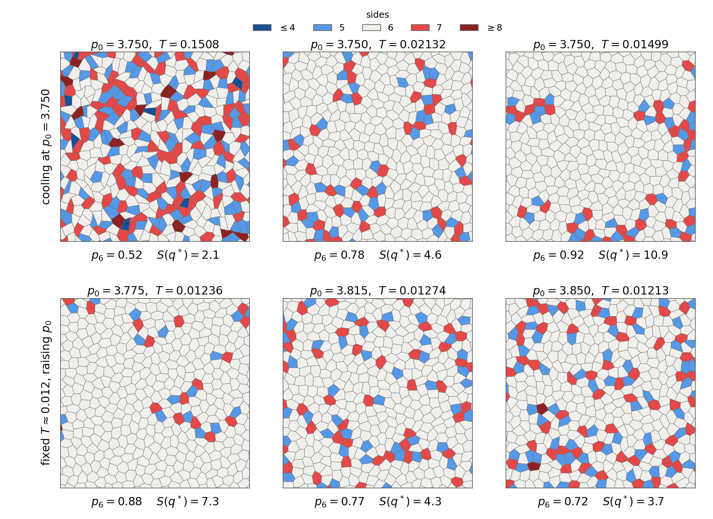
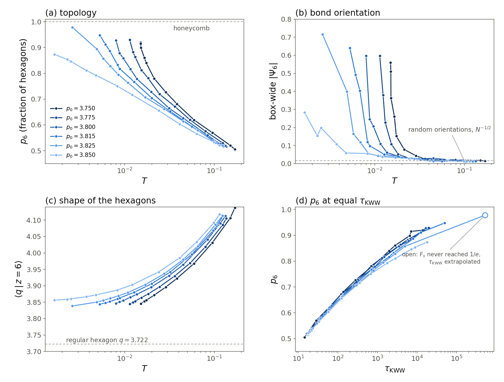
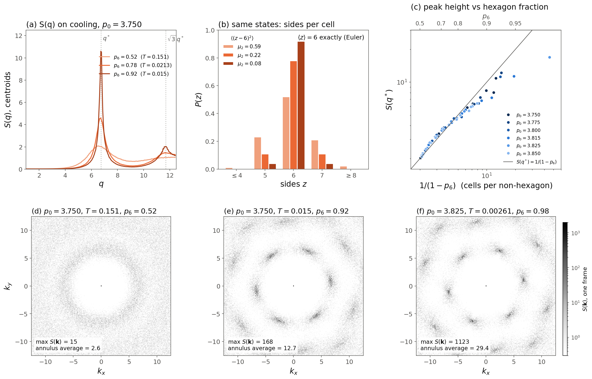
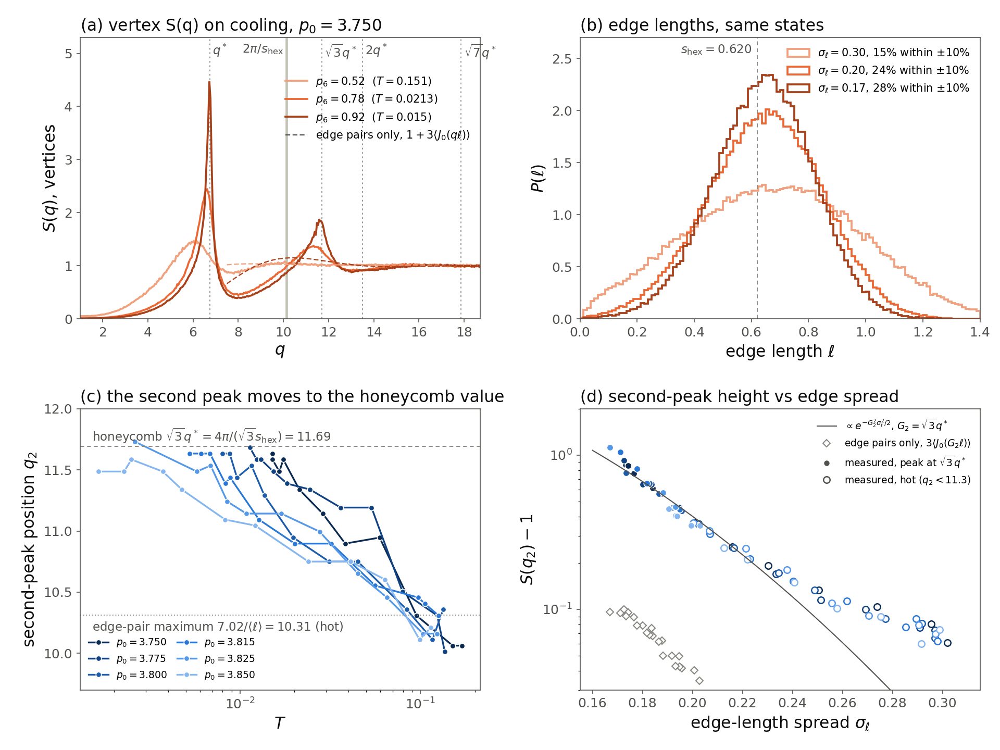

# Vertex cells become hexagons at low \(p_0\) and low \(T\); \(S(q)\) hides it

Generated by Claude Code. 2026-09-30. Production trajectories, \(N=4096\), 70 \((p_0,T)\), last record of each idx \(0..9\).

At the coldest production \(T\) of every \(p_0\), 87–98% of the cells are hexagons (51–57% in the hot fluid). At fixed \(T\), lower \(p_0\) is more hexagonal. Near the glass end the hexagons also line up: the box-wide bond order reaches 0.28–0.72. The centroid \(S(q)\) records all of this only as a taller first peak, with the same liquid-like shape. Four things keep it from showing more:

- Confluence fixes the density and the mean neighbour number, and hexagonality is a many-body property.
- The peak height tracks the spacing between defects, not the hexagon fraction itself.
- The annulus average throws away the six-fold angular pattern.
- The hexagons are irregular enough to wash out the higher Bragg shells.

## What is measured

Each cell polygon is rebuilt from `pos`, `Vneighs` and `VertexCellNeighbors`. For every frame the check \(\sum_i A_i=L^2\) holds and \(\langle z\rangle=6\) exactly; all 700 frames pass. The rebuilt centroids reproduce the stored production \(S(q)\) to \(\approx 0.01\) away from the peak.

- \(z_i\): number of sides (= edge-sharing neighbours). \(p_6\): fraction with \(z=6\). \(\mu_2=\langle(z-6)^2\rangle\).
- Bond order of cell \(j\) over its neighbours \(k\): \(\psi_{6,j}=z_j^{-1}\sum_k e^{6i\theta_{jk}}\). Box-wide \(|\Psi_6|=|\langle\psi_{6,j}\rangle|\). Random orientations give \(|\Psi_6|\approx N^{-1/2}=0.016\).
- Shape of the hexagons: \(q=P/\sqrt A\) against the regular hexagon \(q_{\mathrm{hex}}=\sqrt{8\sqrt3}=3.722\). Also the spread of interior angles around \(120^\circ\).
- \(S(q^*)\): stored production centroid \(S(q)\) (first-quadrant annulus, 10 frames × 10 replicas). \(\tau_{\mathrm{KWW}}\): round-2 centroid CRSISF fit.

## 1. The cells become hexagons



A \(20\times20\) window of the \(64\times64\) box, replica idx 0, last frame. Blue: 5 sides, red: 7, gray: 6. Top: cooling at \(p_0=3.750\). Bottom: fixed \(T\approx0.012\), raising \(p_0\). The labels are state means over the 10 replicas.



- **Topology (a).** \(p_6\) climbs from 0.51–0.57 (\(T>0.09\), all \(p_0\)) to 0.87–0.98 at the coldest \(T\). For comparison, a random Poisson–Voronoi tiling has \(p_6=0.29\). At fixed \(T\) the curves are ordered in \(p_0\) (table below).
- **Bond orientation (b).** \(|\Psi_6|\) sits at the \(N^{-1/2}\) floor over most of the range. It rises only at each \(p_0\)'s coldest 2–4 temperatures, reaching 0.56–0.72 for \(p_0\le3.825\). So one or a few orientational domains span the box. The onset moves to lower \(T\) as \(p_0\) grows, and it passes 0.1 at \(\tau_{\mathrm{KWW}}\approx(1\text{–}3)\times10^3\) for every \(p_0\).
- **Shape (c).** \(\langle q|z=6\rangle\) falls from \(\approx4.1\) to \(\approx3.84\), and is lower at lower \(p_0\) at fixed \(T\). It saturates well above 3.722. The cold hexagons are six-sided and aligned but not regular: interior angles spread by \(\pm20^\circ\) (hot: \(\pm33^\circ\)), and edge lengths within a cell by \(\pm25\%\) (hot: \(\pm40\%\)).
- **Side result (d).** At equal \(\tau_{\mathrm{KWW}}\), \(p_6\) nearly collapses across \(p_0\). At \(\tau_{\mathrm{KWW}}=10^3\) it is 0.77–0.80 for all six \(p_0\). \(p_0=3.850\) sits lowest beyond \(\sim10^3\).

Coldest production \(T\) per \(p_0\), with the hot fluid for reference:

| \(p_0\) | \(T\) | \(p_6\) | \(\mu_2\) | \(\lvert\Psi_6\rvert\) | \(\langle q\,\vert\,6\rangle\) | angle spread | \(S(q^*)\) |
|---:|---:|---:|---:|---:|---:|---:|---:|
| 3.750 | 0.151 (hot) | 0.521 | 0.590 | 0.018 | 4.106 | 32.6° | 2.08 |
| 3.750 | 0.0150 | 0.920 | 0.081 | 0.56 | 3.844 | 20.1° | 10.9 |
| 3.775 | 0.0114 | 0.929 | 0.071 | 0.60 | 3.844 | 20.2° | 12.2 |
| 3.800 | 0.0080 | 0.928 | 0.072 | 0.60 | 3.846 | 20.3° | 11.2 |
| 3.815 | 0.0053 | 0.948 | 0.052 | 0.64 | 3.844 | 20.3° | 11.3 |
| 3.825 | 0.0026 | 0.978 | 0.022 | 0.72 | 3.839 | 20.1° | 17.0 |
| 3.850 | 0.0016 | 0.873 | 0.127 | 0.28 | 3.856 | 20.7° | 6.4 |

Fixed \(T\approx0.012\) (\(p_0=3.750\) has no production \(T\) this cold; its glass end is \(T=0.0150\)):

| \(p_0\) | \(T\) | \(p_6\) | \(\langle q\,\vert\,6\rangle\) | angle spread | \(S(q^*)\) |
|---:|---:|---:|---:|---:|---:|
| 3.775 | 0.0124 | 0.883 | 3.850 | 20.3° | 7.3 |
| 3.800 | 0.0116 | 0.817 | 3.865 | 21.1° | 4.8 |
| 3.815 | 0.0127 | 0.767 | 3.880 | 22.0° | 4.3 |
| 3.825 | 0.0108 | 0.764 | 3.879 | 21.9° | 4.4 |
| 3.850 | 0.0121 | 0.716 | 3.903 | 23.4° | 3.7 |

## 2. Why \(S(q)\) does not show it



**What \(S(q)\) is built from is the same in every state.** Confluence fixes the density (mean area 1). So the first peak sits at the triangular-lattice value \(q^*=4\pi/(\sqrt3\,a)=6.75\), with \(a=(2/\sqrt3)^{1/2}\), for every \(p_0\) and \(T\); measured values are 6.45–6.76 (a). Euler's relation for a 3-valent tiling on a torus fixes \(\langle z\rangle=6\), so the first shell always holds six neighbours on average (b). Cooling does not change the mean; it collapses the spread, \(\mu_2=0.59\to0.22\to0.08\). A pair function counts neighbours on average. The variance of the neighbour count needs three-point correlations, so it does not enter \(g(r)\) or \(S(q)\).

**The peak height follows the spacing between defects.** Empirically \(S(q^*)\approx1/(1-p_6)\): the peak height is about the number of cells per non-hexagonal cell (c). For the 44 states with \(p_6<0.8\), \(S(q^*)(1-p_6)=0.95\)–1.11 for all six \(p_0\). The map is compressive. Going from half to four-fifths hexagons (\(p_6=0.52\to0.78\), non-hexagons more than halved) moves \(S(q^*)\) only from 2.1 to 4.6, and the curve keeps its liquid-like shape (a). Above \(p_6\approx0.9\) the peak falls below \(1/(1-p_6)\) (ratio 0.37–0.87), so the most ordered states are under-reported most.

**The six-fold symmetry is angular, and the annulus average removes it.** Panels (d–f) show the 2D \(S(\mathbf k)\) of one frame (the replica with median \(|\Psi_6|\)). The hot state is an isotropic ring: max 15, annulus average 2.6. At \(p_6=0.92\) the ring splits into six spots at \(q^*\) and six more at \(\sqrt3\,q^*\) rotated by \(30^\circ\), the diffraction pattern of a triangular lattice of centroids. There the spots reach 168 against an annulus average of 12.7. At \(p_6=0.98\) they reach \(1.1\times10^3\) against 29. The isotropic \(S(q)\) cannot tell these spots from a uniform ring of the same integrated intensity.

**The hexagons are irregular.** Cold hexagons have \(\langle q|6\rangle\approx3.84\), angles \(\pm20^\circ\) and edges \(\pm25\%\). For \(p_0>3.722\) a cell with \(A=1\) and \(P=p_0\) cannot be a regular hexagon anyway. This metric disorder acts like a large Debye–Waller factor on the higher shells. That is why \(S(q)\) shows only a weak bump at \(\sqrt3\,q^*\) and nothing that reads as a honeycomb. It is also why the 2026-09-28 \(P(\ell)\) check (edges centred on \(s_{\mathrm{hex}}=0.620\)) came out negative: it tests for regular hexagons, not six-sided cells.

The right structural order parameters here are \(p_6\) (or \(\mu_2\)) and \(\psi_6\), as in 2D melting, where the liquid–hexatic change is likewise invisible in the isotropic \(S(q)\).

## 3. Vertex \(S(q)\): where the edge lengths show up



**Where a regular-hexagon edge should appear.** Regular hexagons of area 1 have side \(s_{\mathrm{hex}}=0.620\). Their vertices form a honeycomb on the same triangular lattice as the centroids, with two vertices per cell joined by one edge \(\boldsymbol\delta\). The Bragg shells are the same as for the centroids (\(q^*=6.75\), \(\sqrt3q^*\), \(2q^*\), …). Each shell carries the basis weight \(|1+e^{i\mathbf G\cdot\boldsymbol\delta}|^2=|1+e^{2\pi i(h+k)/3}|^2\), which is 1 on the \(q^*\), \(2q^*\) and \(\sqrt7q^*\) shells. It is 4 on \(\sqrt3q^*=4\pi/(\sqrt3\,s_{\mathrm{hex}})=11.69\) and \(3q^*=4\pi/s_{\mathrm{hex}}=20.26\), where both ends of every edge scatter in phase. So the edge signature is a peak at 11.69, the strongest vertex peak of a perfect honeycomb, and not at \(2\pi/s_{\mathrm{hex}}=10.13\). In 2D a single spacing \(d\) gives \(J_0(qd)\), whose first maximum is at \(7.02/d\). The position of the 11.69 peak is fixed by the cell density; edge regularity can only change its height.

**What the data show.**

- **Position (c).** In the hot fluid the second vertex maximum is weak (\(S-1=0.06\)–0.08) and sits at \(q_2=10.0\)–10.3. That is the edge-pair bump \(7.02/\langle\ell\rangle=10.3\) for \(\langle\ell\rangle=0.68\). On cooling it moves to the honeycomb value, reaching \(q_2=11.59\)–11.73 at the coldest \(T\) for \(p_0\le3.825\) (11.49 at \(p_0=3.850\)).
- **Height (a, d).** The excess grows to 0.76–1.12 (0.45 at \(p_0=3.850\)). At fixed \(T\approx0.012\), \(p_0=3.775\) has \(q_2=11.59\) and \(S(q_2)-1=0.65\); \(p_0=3.850\) has 11.05 and 0.21.
- **Edges (b).** The edge lengths regularize but stay far from equal. \(\sigma_\ell\) drops from 0.30 to 0.17 and \(\langle\ell\rangle\) from 0.68 to 0.64. The fraction of edges within \(\pm10\%\) of \(s_{\mathrm{hex}}\) rises from 15% to 28%.

**The edge spread sets the height (d).** \(S(q_2)-1\) is one function of the edge-length spread \(\sigma_\ell\) for all six \(p_0\). A smooth fit of \(\ln(S(q_2)-1)\) leaves an rms residual of 0.069 against \(\sigma_\ell\) and 0.096 against \(p_6\). Where the peak sits at \(\sqrt3q^*\) (29 states), \(\ln(S(q_2)-1)\approx2.34-83\,\sigma_\ell^2\). A Debye–Waller factor from edge-length disorder alone, \(e^{-G_2^2\sigma_\ell^2/2}\) with \(G_2=11.69\), gives slope 68, so edge regularity accounts for most of the growth. The rest is probably bond-angle disorder, which \(\sigma_\ell\) does not measure. The edge pairs by themselves contribute only \(3\langle J_0(G_2\ell)\rangle\approx0.1\) (diamonds). The peak is a collective in-phase effect of the whole honeycomb, and the edges control its height.

**Why the peak is weaker than a honeycomb's.** For a perfect honeycomb the \(\sqrt3q^*\) peak would be about 2.3 times the first one (weight 4 against 1, diluted by the ring circumference \(\propto q\)). Measured, its excess is 0.20–0.31 of the first-peak excess. The next in-phase shell, \(4\pi/s_{\mathrm{hex}}=20.26\), lies beyond the stored range (\(q\le18.7\)). At \(\sigma_\ell=0.17\) it would be down by another factor \(\approx e^{-4}\approx0.02\) anyway.

This also settles the 2026-09-28 \(P(\ell)\) note. The edges do not cluster on \(s_{\mathrm{hex}}\), yet the vertex \(S(q)\) does carry the regular-hexagon spacing: as a second peak locked at \(4\pi/(\sqrt3s_{\mathrm{hex}})\), whose height grows as the edges become more uniform.

## Caveats

- The hexagon metrics use the last record of each replica (10 frames per state); \(S(q)\) uses the last 10 records. Replica scatter in \(p_6\) is \(\pm0.01\)–0.02 at the coldest states and smaller elsewhere.
- The cold end is not an amorphous glass in the usual sense. Box-wide \(|\Psi_6|\) of 0.3–0.7 in a 4096-cell box means the tissue is ordering toward a hexagonal (hexatic or polycrystalline) state once \(\tau_{\mathrm{KWW}}\) exceeds a few \(\times10^3\). Separating hexatic from crystal needs the \(N\)-dependence or the positional correlation length.
- \(p_0=3.825\), \(T=0.0026\) is the most ordered state, but its \(F_s\) never reaches \(1/e\), so its \(\tau_{\mathrm{KWW}}\) is extrapolated (open circle in the \(\tau\) panel).

## How to rerun

```bash
python3 glassyDynamicsProject/analyseScripts/vertexTauAlpha/plot_vertex_hexagonality.py --recompute
```

Reads `$CELLGPU_SCRATCH/N4096/vertex/productionRuns/p*/glassyDynamics_*.nc` (last record of each idx) and the stored `structureFactor/sq_*.nc`. It takes about 1 min and is I/O bound. Without `--recompute` it only redraws from `vertexModel_hexagonality/hex_metrics.csv` (about 15 s). Output: `hex_metrics.csv`, `hex_snapshots.png`, `hex_order_vs_T.png`, `hex_vs_sq.png`, `hex_vertex_sq.png`. The vertex panels also read the stored `vertexPositionSq/sqVertex_*.nc`.
