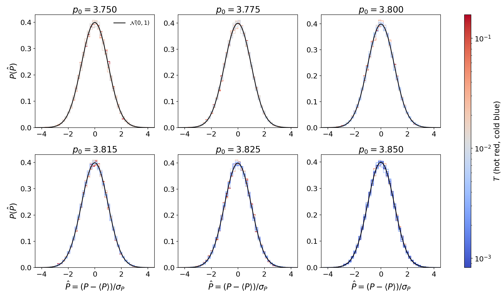
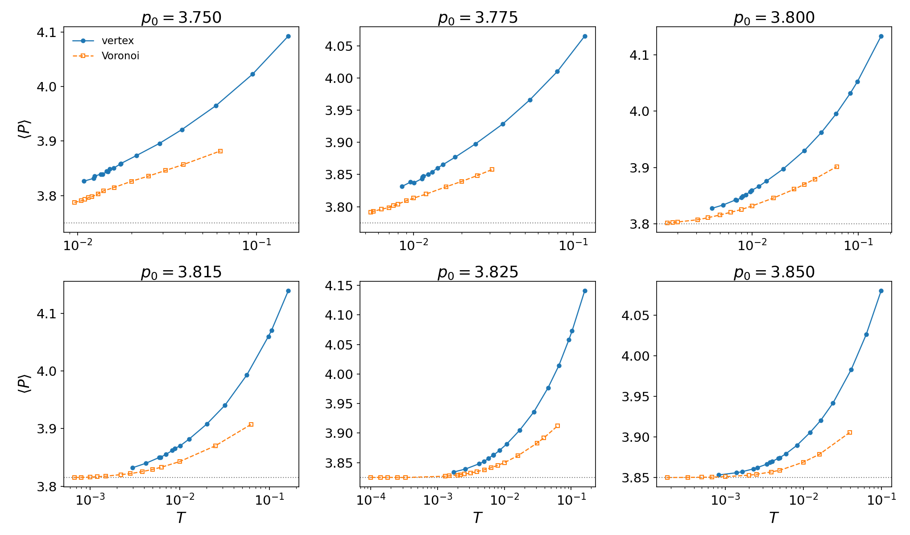
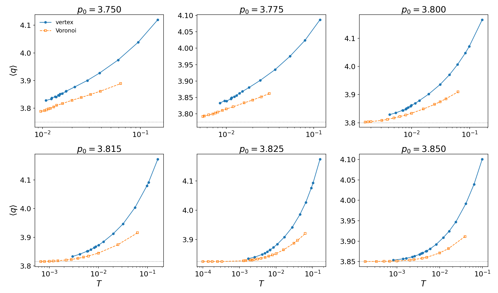

# Vertex vs Voronoi static statistics

Generated by Cursor. 2026-09-09. Same \((p_0,T)\) is not the same mechanical state.

The vertex perimeter PDF is still Gaussian. The **means** \(\langle P\rangle\) and \(\langle q\rangle\) are not: at fixed \(p_0\) they sit above the Voronoi curves and rise faster with \(T\). Matching the energy parameters and the bath temperature therefore does not put the two models in the same ensemble.

## Physics

Quadratic cell energy with \(K_A=K_P=1\) and mean cell area \(A_0=1\):

\[
q_i=\frac{P_i}{\sqrt{A_i}},\qquad
\frac{E}{N}=\langle(A-1)^2\rangle+\langle(P-p_0)^2\rangle.
\]

\(P_i\) is the cell perimeter; \(q_i\) is the isoperimetric shape index (same as `Simple2DCell::reportq`). Reduced temperature \(T\) is \(kT\) in these units. \(\langle P\rangle\) is the time average of the per-frame mean perimeter; \(\langle q\rangle\) is the time average of the per-frame mean shape index, both from the longest-\(t_w\) trajectory. The dotted line on the mean plots is the target \(p_0\).

Gaussianity uses the last eight log-spaced frames, pooled over cells. Standardized perimeter

\[
\hat P=\frac{P-\langle P\rangle}{\sigma_P}
\]

is compared to \(\mathcal N(0,1)\). Vertex \(\ell_{T1}=0.01\). \(N=4096\).

## Gaussianity of the vertex perimeter



No Voronoi overlay. Color is \(T\) on one shared red–blue scale (hot red, cold blue). The histograms collapse onto the unit Gaussian at every \(p_0\). From [`moments.csv`](vertexModel_statDist/moments.csv) over 100 vertex \((p_0,T)\) points: median \(|\mathrm{skew}_P|=0.013\), all \(|\mathrm{skew}_P|<0.06\); median excess kurtosis \(0.017\), all \(|g_2|<0.10\). The vertex perimeter fluctuations look ordinary; the mismatch with Voronoi is in the **location** of the distribution, not its shape.

## Means vs \(T\)

Filled circles: vertex. Open squares: Voronoi. Same six \(p_0\).





Both models have \(\langle P\rangle>p_0\) and \(\langle q\rangle>p_0\) that grow with \(T\). Vertex is systematically higher and steeper. At \(p_0=3.800\):

| Model | Cold \(T\) | \(\langle q\rangle\) | \(\langle P\rangle\) | Hot \(T\) | \(\langle q\rangle\) | \(\langle P\rangle\) |
|-------|-----------:|---------------------:|---------------------:|----------:|---------------------:|---------------------:|
| Vertex | \(0.00423\) | \(3.829\) | \(3.828\) | \(0.164\) | \(4.166\) | \(4.133\) |
| Voronoi | \(0.0016\) | \(3.803\) | \(3.802\) | \(0.063\) | \(3.910\) | \(3.902\) |

At the three matched \((p_0,T)\) points in [`means_vs_T.csv`](vertexModel_stateCompare/means_vs_T.csv) (\(p_0=3.800\), \(T=0.016,0.010,0.008\)), vertex \(\langle q\rangle\) is \(0.039\), \(0.027\), and \(0.024\) above Voronoi. The same offset appears on every \(p_0\) panel wherever the \(T\) windows overlap.

So the two models are not interchangeable at a given \((p_0,T)\): the vertex mesh is more expanded (larger mean \(P\) and \(q\)) even though its \(P\) fluctuations remain Gaussian.

## How to rerun

Means from [`vertex_q_vs_T.csv`](vertexModel_qMap/vertex_q_vs_T.csv) and [`voronoi_q_vs_T.csv`](vertexModel_qMap/voronoi_q_vs_T.csv). Gaussian histograms from [`vertexModel_statDist/dumps/vertex_*_cells.csv`](vertexModel_statDist/dumps/). No new NetCDF dumps.

```bash
python3 glassyDynamicsProject/analyseScripts/vertexTauAlpha/plot_stat_compare_panels.py
```

Writes `vertexModel_statDist/mean_P_vs_T_all_p0.png`, `mean_q_vs_T_all_p0.png`, and `vertex_P_gaussian_all_p0.png`.
