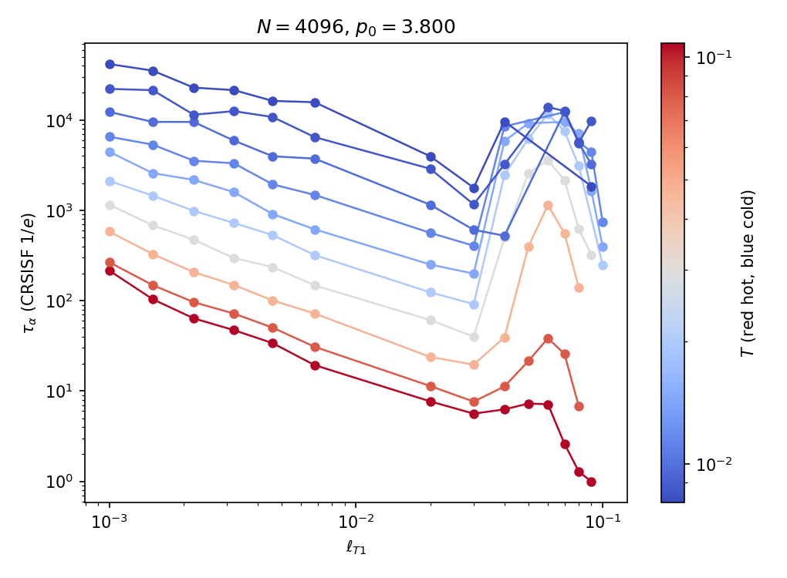
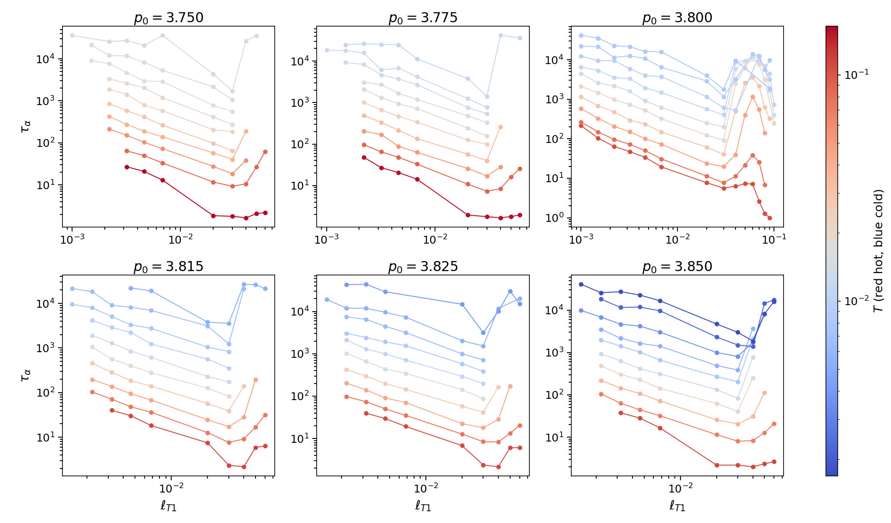
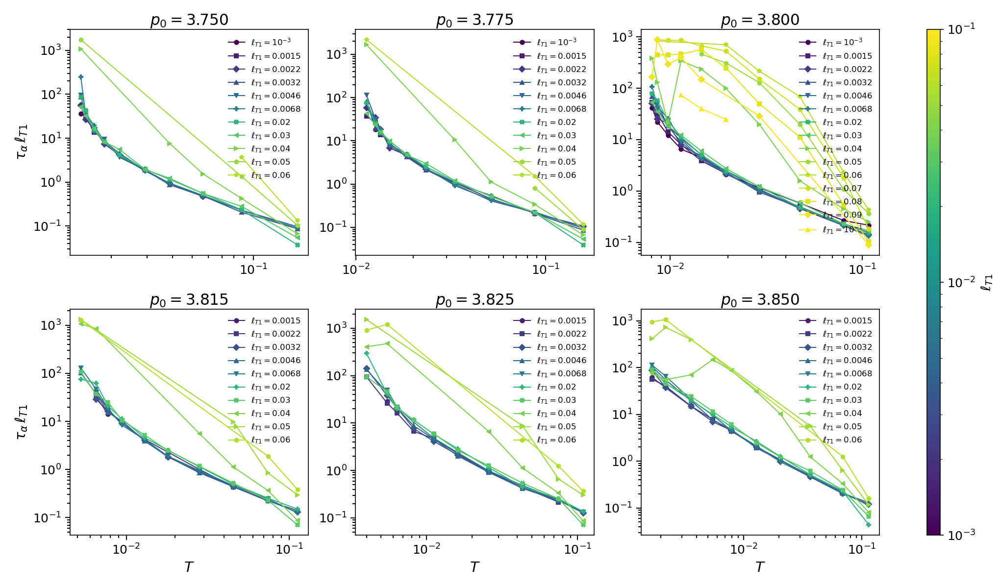
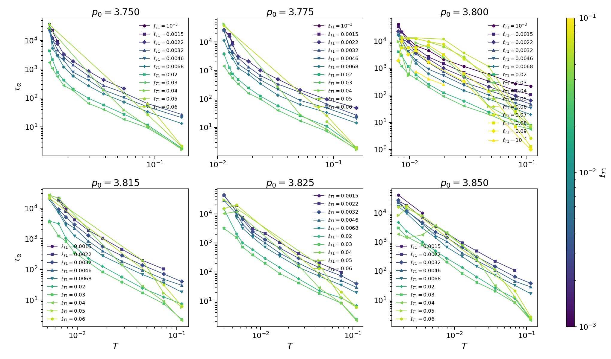

# Vertex T1-threshold scan

Generated by Cursor. 2026-09-09. Campaign, protocol, and what \(\ell_{T1}\) does to \(\tau_\alpha\).

The constructor default in `vertexModelBase` is \(\ell_{T1}=0.01\) (mean cell area \(1\)). This scan asks whether that cutoff is a harmless numerical detail or a physical control on structural relaxation. It is the latter: at fixed \((p_0,T)\), \(\tau_\alpha\) changes by more than a decade when \(\ell_{T1}\) is moved through the stable window \(\sim 10^{-3}\)–\(0.03\).

## Physics

A T1 is a neighbor-exchange (edge flip) of four cells. In cellGPU the test is geometric, not energy-barrier:

\[
\text{T1 if }\quad \ell_{ij} < \ell_{T1},
\]

where \(\ell_{ij}\) is the periodic length of the edge between vertices \(i\) and \(j\). Lengths are in units with mean cell area \(A_0=1\). Implementation: `vertexModelBase::testAndPerformT1TransitionsCPU` / `testEdgesForT1GPU`.

Smaller \(\ell_{T1}\) means an edge must shrink further before a topology change. T1s become rarer, cages last longer, and the cage-relative SISF of **cell centroids** decays later. Larger \(\ell_{T1}\) lets short thermal fluctuations trigger flips; past \(\ell_{T1}\gtrsim 0.04\) the mesh is no longer a small perturbation of the default cutoff (crashes, short \(t_w\), non-monotonic \(\tau_\alpha\)).

Energy and bath are the usual vertex quadratic energy (\(K_A=K_P=1\), uniform \(p_0\)) plus Nose–Hoover NVT. Reduced temperature \(T\) is \(kT\) in those units. The T1 threshold is **not** scaled with \(T\) in the production runs; trial plots of \(\ell_{T1}T^{1/2}\) and \(\ell_{T1}/T^{1/2}\) are diagnostics only.

## How \(\tau_\alpha\) is measured

Same definition as the vertex scouting report ([`vertexModel_tauAlpha_report.md`](vertexModel_tauAlpha_report.md)):

\[
F_s^{\mathrm{CR}}(q,\Delta t)=\frac{1}{N}\sum_j J_0\!\left(q\,|\Delta\mathbf{r}_j^{\mathrm{CR}}|\right),\qquad
\tau_\alpha=\min\{\Delta t:F_s^{\mathrm{CR}}(q,\Delta t)\le 1/e\}.
\]

Wavevector \(q=6.80\). Tracer = cell centroid. Cage = cell–cell neighbors at waiting time \(t_w\). Per \((\ell_{T1},p_0,T)\) keep the longest \(t_w\) that still crosses \(1/e\) (no extrapolation). Combined Wave A figures also drop points with \(\tau_\alpha>5\tau_{\mathrm{est}}\) except \(p_0=3.800\), which uses the earlier 15-block t1Scan table as-is. `--nocut` keeps every crossing.

## Shared run parameters

| Quantity | Value |
|----------|--------|
| \(N\) | \(4096\) cells |
| \(dt\) | \(0.01\) |
| replica | `idx=0` |
| \(p_0\) | \(3.750, 3.775, 3.800, 3.815, 3.825, 3.850\) |
| \(T\) grid | recommended vertex \(T\) at \(\tau_k=10^{1+k/3}\) ([`recommended_T.csv`](vertexModel_tauAlpha_final/recommended_T.csv)) |
| \(\tau_{\mathrm{block}}\) | \(\max(\tau_k,1000)\) except the \(p_0=3.800\), \(\ell_{T1}=0.04\)–\(0.09\) scout (\(\tau_{\mathrm{block}}=1000\) for all \(T\)) |
| default \(\ell_{T1}\) | \(0.01\) (not rerun under `t1Scan/`; overlay from scouting \(T\), nearby but not the recommended grid) |

Driver flags: `vertexTauAlphaTest.out -a <l_T1>` writes `$CELLGPU_SCRATCH/N4096/vertex/t1Scan/t1_<tag>/p<…>/` and does not touch the default-threshold `vertex/p*/` trees. Folder tag: exact decade \(10^{n}\) → `1e-4`; otherwise `%g` (`t1_0.02`). FS: `vertexTauAlphaFs.out -a <l_T1>`.

**Protocols.** \(p_0=3.800\) t1Scan used the original 15 log-spaced trajectories after one \(\tau_{\mathrm{block}}\) of equilibration (later compact save: evolve 15 blocks, register only \(k=14\)). Other \(p_0\) (Wave A) used compact `-c`: equilibrate \(10\tau_{\mathrm{block}}\) with no dumps, then one log-spaced trajectory of length \(5\tau_{\mathrm{block}}\) at \(t_w=10\tau_{\mathrm{block}}\).

## Experiments (in order)

### 1. Decade scan at \(p_0=3.800\)

CSV [`vertexModel_t1Scan/state_points.csv`](vertexModel_t1Scan/state_points.csv). \(\ell_{T1}=10^{-4},10^{-3},10^{-1}\) (30 jobs). Skip \(10^{-2}\); reuse existing longest-crossed default-threshold curve.

Result: \(\ell_{T1}=10^{-3}\) is **slower** than default \(10^{-2}\) at the same \(T\). \(\ell_{T1}=10^{-4}\): 150 CRSISF files, **none** crossed \(1/e\) (T1s too rare for this window). \(\ell_{T1}=10^{-1}\): FS jobs aborted (heap / NetCDF); only a few files.

### 2. Interior \(\ell_{T1}\) at \(p_0=3.800\)

CSV [`state_points_interior.csv`](vertexModel_t1Scan/state_points_interior.csv). \(\ell_{T1}=0.0015,0.0022,0.0032,0.0046,0.0068,0.02,0.03\) (70 jobs). Same ten \(T\). All 150 CRSISF files each.

### 3. Large-threshold scout at \(p_0=3.800\)

CSV [`state_points_004_009.csv`](vertexModel_t1Scan/state_points_004_009.csv). \(\ell_{T1}=0.04\)–\(0.09\), every job \(\tau_{\mathrm{block}}=1000\). \(0.04\): all ten \(T\) crossed. \(0.05\)–\(0.06\): six \(T\) with full CRSISF. \(0.07\)–\(0.09\): partial FS (segfault / heap).

### 4. Wave A: all other \(p_0\), \(\ell_{T1}\le 0.06\)

CSV [`state_points_all_p0.csv`](vertexModel_t1Scan/state_points_all_p0.csv). Skip \(p_0=3.800\) and \(\ell_{T1}=0.01\). First all-550 attempt died on disk quota; after scratch cleanup, compact `-c` production + FS completed. Harvest: 700 t1Scan points; **427** kept with the \(5\tau_{\mathrm{est}}\) cut, **517** with `--nocut` (crossings only). Combined figures replace leftover last-\(t_w\) harvest at \(p_0=3.800\) with the archive table [`vertex_t1_tau_vs_T.csv`](vertexModel_t1Scan/vertex_t1_tau_vs_T.csv).

Wave B ([`state_points_all_p0_waveB.csv`](vertexModel_t1Scan/state_points_all_p0_waveB.csv), \(\ell_{T1}=0.07\)–\(0.1\)) was **not** submitted (crash-prone at \(p_0=3.800\)).

## Effect of the T1 threshold

### Main result

**Decreasing \(\ell_{T1}\) increases \(\tau_\alpha\) at fixed \((p_0,T)\).** Topology change is the bottleneck: a tighter length cutoff suppresses neighbor exchanges and lengthens structural relaxation.

At \(p_0=3.800\), comparing \(\ell_{T1}=10^{-3}\) to \(0.03\) on the recommended \(T\) grid (longest-crossed, archive):

| \(T\) | \(\tau_\alpha(10^{-3})\) | \(\tau_\alpha(0.03)\) | ratio | \(\tau_\alpha\ell_{T1}\) at \(10^{-3}\) | at \(0.03\) |
|------:|------------------------:|---------------------:|------:|--------------------------------------:|------------:|
| \(0.108\) (hot) | \(216\) | \(5.63\) | \(38\) | \(0.22\) | \(0.17\) |
| \(0.0291\) | \(1.16\times 10^3\) | \(40.0\) | \(29\) | \(1.16\) | \(1.20\) |
| \(0.00804\) (cold) | \(4.16\times 10^4\) | \(1.78\times 10^3\) | \(23\) | \(42\) | \(53\) |

The default \(\ell_{T1}=0.01\) sits on this decreasing branch: it is **not** in a plateau where \(\tau_\alpha\) is independent of the cutoff.

### Window \(\ell_{T1}\sim 10^{-3}\)–\(0.03\)

\(\tau_\alpha(\ell_{T1})\) at fixed \(T\) is smooth and monotonically decreasing (log–log, one polyline per \(T\)):

Hot isotherms (red) fall more steeply than cold ones (blue). The product \(\tau_\alpha\ell_{T1}\) versus \(T\) nearly collapses for this family of thresholds at \(p_0=3.800\), which is the scaling one would write if the T1 attempt rate were linear in \(\ell_{T1}\) at fixed \(T\). It is a useful collapse, not a derived rate theory: the ratio \(\tau(10^{-3})/\tau(0.03)\) is \(\sim 20\)–\(40\) while \(\ell_{T1}\) itself changes by a factor \(30\), so the effective power is a bit weaker than \(1\) at low \(T\).

Trial reductions \(\tau_\alpha T^{1/2}\), \(\tau_\alpha T^{2}\), \(\ell_{T1}T^{1/2}\), and \(\ell_{T1}/T^{1/2}\) do **not** improve the collapse over \(\tau_\alpha\ell_{T1}\) vs \(T\).

### Extremes: too small and too large

- \(\ell_{T1}=10^{-4}\): no \(1/e\) crossing in the production window. The system is effectively T1-starved; reported \(\tau_\alpha\) would be a lower bound only.
- \(\ell_{T1}\gtrsim 0.04\): the \(\tau_\alpha(\ell_{T1})\) curves turn up or scatter. Short \(t_w\), incomplete FS, and crashes appear. \(\tau_\alpha\ell_{T1}\) for these points sits **above** the small-\(\ell_{T1}\) collapse — they are not the same dynamical family.
- \(\ell_{T1}=0.1\): unusable as a production threshold (heap / NetCDF abort).

So there is a **usable window** around and below the default \(0.01\), down to about \(10^{-3}\), and a **broken window** at large threshold where the mesh is over-flipped.

### All six \(p_0\) (Wave A)

The same pattern holds at every packing in the scouting set: smaller \(\ell_{T1}\) → larger \(\tau_\alpha\); \(\tau_\alpha\ell_{T1}\) vs \(T\) collapses for \(\ell_{T1}\lesssim 0.03\) and fans out for \(0.04\)–\(0.06\).

At the hottest kept \(T\), \(\tau_\alpha\) typically drops from \(\mathcal{O}(10)\)–\(\mathcal{O}(10^2)\) at \(\ell_{T1}\sim 3\times 10^{-3}\) to \(\mathcal{O}(1)\)–\(\mathcal{O}(10)\) at \(\ell_{T1}=0.03\). Cold isotherms move less in \(\ell_{T1}\) once \(\tau_\alpha\) is already \(10^4\), and the \(5\tau_{\mathrm{est}}\) cut removes many of those points on the non-\(3.800\) panels.

`--nocut` figures (`*_nocut.png`) keep every crossing (581/680 Wave A rows with a finite \(\tau_\alpha\)). They do not change the qualitative \(\ell_{T1}\) trend.

### Relation to Voronoi and to the default vertex table

Overlay of Voronoi SISF \(1/e\) at the same \(p_0\) ([`vertex_t1_tau_vs_T.png`](vertexModel_t1Scan/vertex_t1_tau_vs_T.png)): even the **fastest stable** vertex thresholds (\(\ell_{T1}\sim 0.03\)) remain slower than Voronoi at the same \(T\). Raising \(\ell_{T1}\) inside the stable window does **not** map the vertex model onto the Voronoi \(\tau(T)\). That is consistent with the static comparison: vertex \(P(\ell)\) has no weight below \(\ell_{T1}\), while Voronoi has a short-edge tail, and \(\langle q\rangle\) and hexatic weight differ at matched \((p_0,T)\).

The published vertex scouting \(\tau_\alpha(T)\) (batches 2–4) is the **default** \(\ell_{T1}=0.01\) curve. Any comparison that treats that table as “the” vertex model should state the threshold. Changing \(\ell_{T1}\) from \(10^{-3}\) to \(0.03\) is a larger dynamical effect than a small shift in \(p_0\) at fixed default threshold.

## Figures and tables

| File | Content |
|------|---------|
| [`vertex_t1_tau_vs_T.csv`](vertexModel_t1Scan/vertex_t1_tau_vs_T.csv) | \(p_0=3.800\) longest-crossed (15-block t1Scan + default overlay + Voronoi) |
| [`vertex_t1_tau_waveA.csv`](vertexModel_t1Scan/vertex_t1_tau_waveA.csv) | Wave A harvest with \(5\tau_{\mathrm{est}}\) keep flag; \(p_0=3.800\) from archive |
| [`vertex_t1_tau_waveA_nocut.csv`](vertexModel_t1Scan/vertex_t1_tau_waveA_nocut.csv) | Same, keep every \(1/e\) crossing |
| [`vertex_t1_tau_vs_T.png`](vertexModel_t1Scan/vertex_t1_tau_vs_T.png) | \(p_0=3.800\), \(\tau_\alpha(T)\) by \(\ell_{T1}\), Voronoi squares |
| [`vertex_t1_tau_vs_lth.png`](vertexModel_t1Scan/vertex_t1_tau_vs_lth.png) | \(p_0=3.800\), \(\tau_\alpha(\ell_{T1})\), color \(\log T\) |
| [`vertex_t1_tau_lth_vs_T.png`](vertexModel_t1Scan/vertex_t1_tau_lth_vs_T.png) | \(p_0=3.800\), \(\tau_\alpha\ell_{T1}\) vs \(T\) |
| [`vertex_t1_tau_*_all_p0.png`](vertexModel_t1Scan/) | Combined \(2\times 3\) panels (cut and `_nocut`) |

Plot entry points: `plot_vertex_t1_tau_alpha.py`, `plot_vertex_t1_tau_vs_lth.py`, `plot_vertex_t1_tau_lth_vs_T.py`, `plot_vertex_t1_waveA_panels.py` (`--nocut` optional).

## Caveats

- One replica (`idx=0`); no error bars.
- Default \(\ell_{T1}=0.01\) overlay uses the scouting \(T\) list, not the recommended grid.
- \(p_0=3.800\) and other \(p_0\) do not share the same \(t_w\) protocol (15-block vs compact \(10+5\)).
- Wave B (\(\ell_{T1}\ge 0.07\) at five \(p_0\)) is missing.
- Large-\(\ell_{T1}\) \(\tau_\alpha\) can come from short \(t_w\) and should not be over-interpreted.
- Other SSH clones need `git pull` and a rebuild of `vertexTauAlphaTest.out` / `vertexTauAlphaFs.out` before new T1 jobs (`-a`, `-c`).
