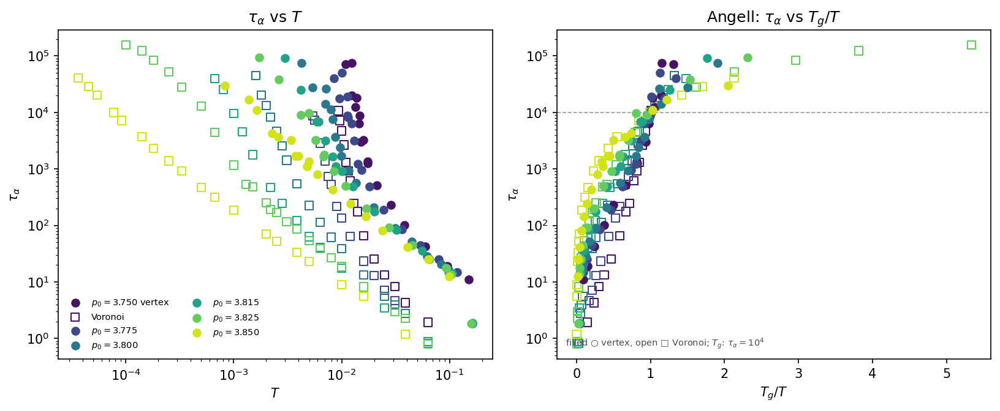

# Vertex-model \(\tau_\alpha\) scouting: estimates and Voronoi comparison

Generated by Cursor. 2026-08-26. Narrative of the four-batch vertex \(\tau_\alpha\) campaign and the \(T\) grid we would use next. Batch-by-batch \(T\) lists live in [`glassyDynamicsProject/vertexTauAlphaStatePoints.md`](../../vertexTauAlphaStatePoints.md). Numbers and the figure below are from `python3 glassyDynamicsProject/analyseScripts/vertexTauAlpha/plot_vertex_voronoi_comparison.py`.

## Goal

We wanted vertex-model structural relaxation times \(\tau_\alpha(T)\) in the window \(\sim 10\)–\(10^4\) at the same six target shape indices as the 2D Voronoi table: \(p_0=3.750, 3.775, 3.800, 3.815, 3.825, 3.850\). All scouting runs used \(N=4096\), \(dt=0.01\), one replica (`idx=0`), and \(\tau_{\mathrm{block}}=\max(\tau_{\mathrm{est}},1000)\), with fifteen log-spaced waiting times after one equilibration block.

## How \(\tau_\alpha\) is measured

\(\tau_\alpha\) is the lag where the cage-relative self-intermediate scattering function (CRSISF)

\[
F_s^{\mathrm{CR}}(q,\Delta t)=\frac{1}{N}\sum_j J_0\!\left(q\,|\Delta\mathbf{r}_j^{\mathrm{CR}}|\right)
\]

crosses \(1/e\). The wavevector is \(q=6.80\), the same \(k\) as Voronoi `tauAlphaTableAnalyse`. For the vertex model the tracer is the **cell centroid** (polygon centroid of that cell’s vertex ring), not a vertex coordinate. The cage is the set of cell–cell neighbors at \(t_w\). Per \((p_0,T)\) we keep the longest \(t_w\) whose CRSISF still crosses \(1/e\) (no extrapolation if it never drops through \(1/e\)).

## From Voronoi guesses to a vertex \(\tau(T)\) curve

The first batch used existing Voronoi \(T\) whose Voronoi \(\tau_\alpha\) already sat in \(10\)–\(10^4\) ([`tauAlpha_2DVoronoi_all.csv`](../TauAlphaTable/data_2DVoronoi/tauAlpha_2DVoronoi_all.csv)). Those temperatures were a reasonable starting guess, but they are not the vertex-model temperatures for the same \(\tau_\alpha\): at a given \(T\), vertex \(\tau_\alpha\) was systematically **larger** than Voronoi \(\tau_\alpha\) (geometric-mean factor of order \(20\)–\(50\), depending on \(p_0\)). In other words the vertex model is slower, so the same relaxation-time window sits at **higher** \(T\).

We then invented hotter \(T\) so that a scaled Voronoi curve would hit ten log-spaced targets \(\tau_k=10^{1+k/3}\) (\(k=0,\ldots,9\)). After those runs we read \(T\) off the *measured* vertex \(\tau(T)\) by interpolating \(\log\tau\) vs \(1/T\) (Arrhenius coordinates; hotter than the table: \(\log\tau\) vs \(\log T\)) and retargeted any point still off by a factor \(\gtrsim 1.5\), or whose longest \(t_w\) never crossed \(1/e\). That measure–interpolate–retarget loop ran three more times (four batches in total). Later batches override the same \(T\). The first batch is **not** used in the final curve: those waiting times used the Voronoi \(\tau_{\mathrm{block}}\) and are too short.

After batch 4 the combined longest-crossed set from batches 2–4 (100 \((p_0,T)\) points, same \(\tau_{\mathrm{block}}\) protocol) is smooth enough to read off a production grid.

## Temperatures we would like to test

These \(T\) are the vertex temperatures at which the interpolated longest-crossed \(\tau(T)\) equals \(\tau_k=10^{1+k/3}\). Pass `-t` \(=\tau_k\) so \(\tau_{\mathrm{block}}=\max(\tau_k,1000)\). CSV: [`vertexModel_tauAlpha_final/recommended_T.csv`](vertexModel_tauAlpha_final/recommended_T.csv).

| \(p_0\) | \(10\) | \(21.5\) | \(46.4\) | \(100\) | \(215\) | \(464\) | \(10^3\) | \(2154\) | \(4642\) | \(10^4\) |
|--------:|------:|--------:|--------:|-------:|-------:|-------:|--------:|--------:|--------:|--------:|
| 3.750 | 0.1640 | 0.08720 | 0.05635 | 0.03871 | 0.02929 | 0.02198 | 0.01853 | 0.01652 | 0.01499 | 0.01422 |
| 3.775 | 0.1577 | 0.08785 | 0.05159 | 0.03316 | 0.02344 | 0.01853 | 0.01510 | 0.01345 | 0.01266 | 0.01135 |
| 3.800 | 0.1081 | 0.07998 | 0.04733 | 0.02909 | 0.01950 | 0.01453 | 0.01139 | 0.009728 | 0.008574 | 0.008043 |
| 3.815 | 0.1127 | 0.07417 | 0.04555 | 0.02812 | 0.01803 | 0.01296 | 0.009410 | 0.007728 | 0.006527 | 0.005263 |
| 3.825 | 0.1091 | 0.07498 | 0.04337 | 0.02587 | 0.01618 | 0.01115 | 0.008210 | 0.006381 | 0.005484 | 0.004002 |
| 3.850 | 0.1146 | 0.06898 | 0.03667 | 0.02057 | 0.01287 | 0.007917 | 0.005504 | 0.003602 | 0.002194 | 0.001687 |

The \(\tau=10\) entries at \(p_0=3.750\), \(3.775\), and \(3.850\) sit hotter than the measured table and use \(\log\tau\) vs \(\log T\).

## Glass temperature and comparison figures

For the Angell axis only, \(T_g\) is the temperature where \(\tau_\alpha=10^4\), using the same \(\log\tau\) vs \(1/T\) interpolation. Voronoi \(p_0=3.775\) is a short extrapolation (the table tops out at \(\tau\approx 8.7\times 10^3\)). CSV: [`vertexModel_tauAlpha_final/Tg.csv`](vertexModel_tauAlpha_final/Tg.csv).

| \(p_0\) | \(T_g^{\mathrm{vertex}}\) | \(T_g^{\mathrm{Voronoi}}\) | \(T_g^{\mathrm{v}}/T_g^{\mathrm{V}}\) |
|--------:|--------------------------:|---------------------------:|--------------------------------------:|
| 3.750 | 0.01422 | 0.009350 | 1.52 |
| 3.775 | 0.01135 | 0.005252 | 2.16 |
| 3.800 | 0.008043 | 0.002117 | 3.80 |
| 3.815 | 0.005263 | 0.000989 | 5.32 |
| 3.825 | 0.004002 | 0.000534 | 7.50 |
| 3.850 | 0.001687 | \(7.67\times 10^{-5}\) | 22.0 |

The ratio \(T_g^{\mathrm{vertex}}/T_g^{\mathrm{Voronoi}}\) grows with \(p_0\): the vertex slowdown relative to Voronoi is larger toward the fluid side of the \(p_0\) window.

**Left.** \(\tau_\alpha\) vs \(T\) (log–log). Filled circles: vertex (longest-crossed CRSISF, batches 2–4). Open squares: Voronoi table. Color is \(p_0\). At every \(p_0\) the vertex points sit at higher \(T\) for the same \(\tau_\alpha\) (vertex is slower).

**Right.** Same symbols and colors, vs \(T_g/T\), each model using its own \(T_g(p_0)\). After that collapse the two models have similar qualitative Angell (fragile) curvature; remaining scatter is mostly \(p_0\) and the limited vertex range below \(T_g\).

Vertex points plotted: [`vertexModel_tauAlpha_final/vertex_longest_crossed.csv`](vertexModel_tauAlpha_final/vertex_longest_crossed.csv).
